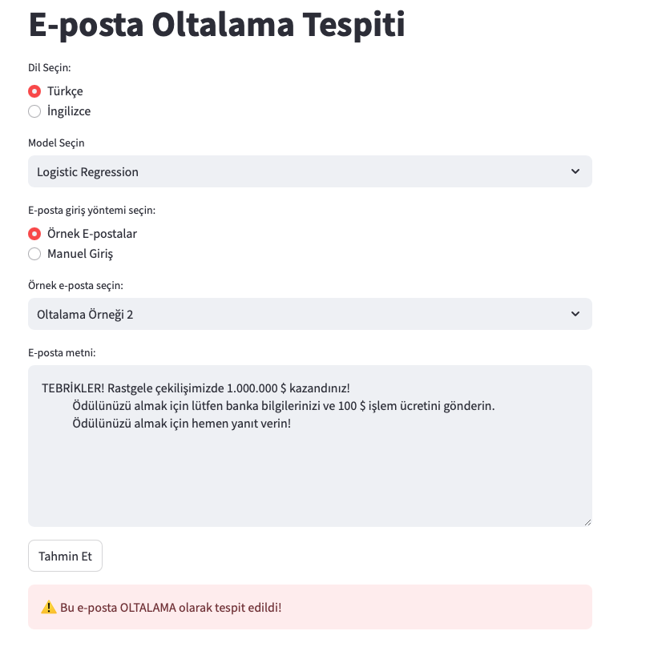

# E-posta Oltalama Tespiti Projesi

Bu proje, makine öğrenmesi ve derin öğrenme yöntemlerini kullanarak e-postaların oltalama (phishing) içerip içermediğini tespit eden bir sistemdir.

## Veri setleri :

**İngilizce veri seti:** [zefang-liu/phishing-email-dataset](https://huggingface.co/datasets/zefang-liu/phishing-email-dataset)
**Türkçe veri seti:** [anilguven/turkish_spam_email](https://huggingface.co/datasets/anilguven/turkish_spam_email)

## 📊 Test Verisi Sonuçları

| Model | Accuracy | Precision | Recall | F1-Score |
|-------|----------|-----------|---------|-----------|
| SVM | %98.37 | %97.96 | **%97.66** | %97.81 |
| SVM-CV | **%98.44** | **%98.36** | %97.46 | **%97.90** |
| Logistic Regression | %97.83 | %97.15 | %97.05 | %97.10 |
| MLP | %97.98 | %97.16 | %97.46 | %97.31 |
| Naive Bayes | %96.24 | %95.57| %94.30 | %94.93 |
| DNN | %97.91 | %96.77 | **%97.66** | %97.22 |


## 📊 Gerçek Test Verisi Sonuçları

| Model | Accuracy |
|-------|----------|
| SVM | **%86.36**| 
| SVM-CV | **%86.36** | 
| Logistic Regression | %77.27 |
| MLP | %72.73 |
| Naive Bayes | **%86.36** |
| DNN | %72.73 |

## 📊 Türkçe Veri ile Sonuçlar

| Model | Accuracy | Precision | Recall | F1-Score |
|-------|----------|-----------|---------|-----------|
| SVM-CV | %92.61 | %89.81 | **%96.04** | %92.82 |
| Logistic Regression | **%93.10** | %91.43 | %95.05 | **%93.20** |
| MLP | %90.15 | %85.84 | **%96.04** | %90.65 |
| Naive Bayes | %92.61 | **%94.79** | %90.10 | %92.39 |
| DNN | %91.13 | %88.79 | %94.06 | %91.35 |


## 🛠 Kurulum

1. Projeyi klonlayın: 
```
git clone https://github.com/zeynepgulhanuslu/BLG-607-Data-mining-project.git phishing-mail-detection
cd phishing-mail-detection 
```
2. Gerekli paketleri yükleyin:
```
pip install -r requirements.txt
```
3. Veri analizi ve ön işleme:
Veri analizi ve ön işleme için Jupyter Notebook kullanılır. 
```
python src/notebooks/data_analysis.ipynb
```
4. Model eğitimi:
SVM ve SVM-CV modelleri için:
```
python src/notebooks/svm_training.ipynb
```
Logistic Regression için:
```
python src/notebooks/logistic_regression.ipynb
```
MLP için:
```
python src/notebooks/mlp_training.ipynb
```
DNN için:
```
python src/notebooks/dnn_model_training.ipynb
```
notebook ları kullanılır. Adım adım çalıştırarak görebilirsiniz.

5. Streamlit projesini çalıştırma:

Eğitilmiş modelleri kullanarak e-postaların oltalama içerip içermediğini tespit eden bir web arayüzü oluşturulmuştur.
Tek bir mail için tahmin yapmak için:
```
python src/phishing_mail_detection_app.py
```
## 💡 Kullanım

1. Web arayüzünden bir model seçin
2. E-posta metnini girin veya örnek e-postalardan birini seçin
3. "Tahmin Et" butonuna tıklayın
4. Sonucu görüntüleyin


## Proje Sunumu
Proje sunumuna [buradan](https://drive.google.com/file/d/1VAGPs2f-xKu38PdWu1L5pFvH0MEFBhaC/view?usp=sharing) ulaşabilirsiniz.


